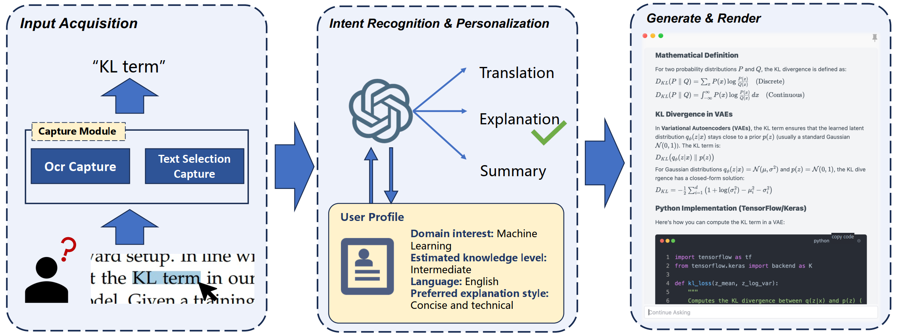
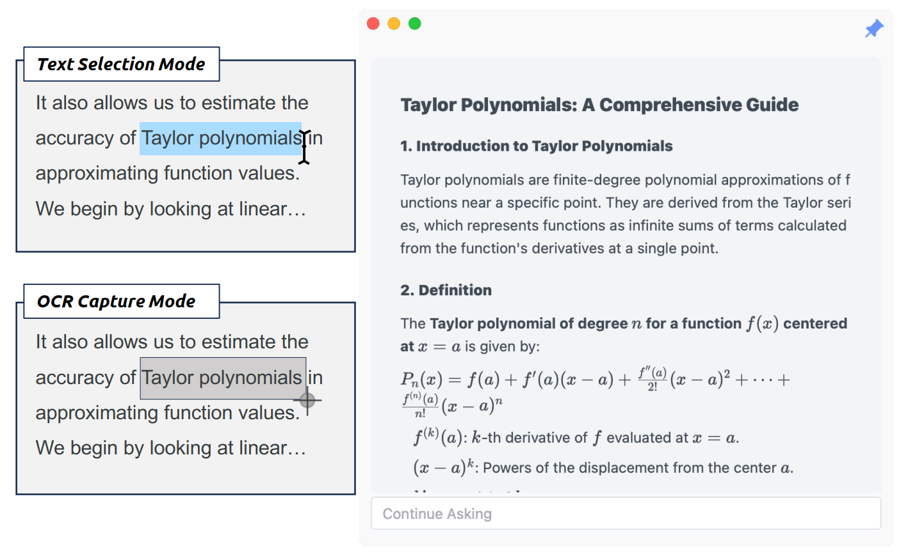

<div align="center">
  
  
  # 随问（Swen）
  
  ### 即时且个性化的大语言模型桌面助手
  
  [](LICENSE)
  []()
  [](https://tauri.app/)
  
  [English](README_EN.md) | 简体中文
  
</div>

---

## ✨ 项目简介

随问（**Swen**） 是一款跨平台桌面智能助手，旨在将大语言模型（LLM）的强大能力无缝集成到您的日常工作流程中。无需在应用间频繁切换，无需手动复制粘贴文本，只需选中内容并按下快捷键，Swen 即可为您提供即时、个性化的智能解答。

### 💡 核心理念

传统的 LLM 使用方式需要用户不断切换应用、复制文本、手动编写提示词，这些重复的操作不仅中断了认知流程，也极大降低了学习和工作效率。Swen 通过将 LLM 能力直接嵌入操作系统环境，让 AI 辅助变得**持续、智能且无缝**。

---

## 🎯 核心特性

### 1️⃣ 无缝交互体验
- **一键唤起**：选中文本 + 快捷键，即可获得 AI 解答
- **无需切换**：直接在当前应用中使用，不打断工作流
- **跨平台支持**：Windows 和 macOS 统一体验

### 2️⃣ 智能输入捕获
- **文本选择模式**：支持在任意可编辑区域直接选中文本
- **OCR 识别模式**：针对 PDF、图片、扫描文档等不可选中内容，自动切换到 OCR 模式
- **双模式智能切换**：系统自动判断，用户无需手动选择

### 3️⃣ 自动意图识别
基于使用场景自动识别用户意图，无需编写提示词：
- 📝 **总结**：长文本自动生成摘要
- 🌐 **翻译**：外语词汇即时翻译
- 💡 **解释**：技术术语深度讲解

### 4️⃣ 个性化知识引擎
持续学习您的偏好，提供量身定制的回答：
- **领域兴趣**：根据您的专业背景调整解释角度
- **知识水平**：自适应调整解释深度
- **语言偏好**：保持一致的术语和输出语言
- **回答风格**：简洁、详细或示例驱动，随您而变

### 5️⃣ 富文本渲染
- 支持 Markdown 格式
- 代码高亮显示
- 数学公式渲染
- Mermaid 图表生成

---

## 🏗️ 系统架构

<div align="center">
  
  <p><i>Swen 系统架构流程图</i></p>
</div>

### 核心模块

1. **输入捕获模块（Input Acquisition）**
   - 系统级文本选择捕获
   - OCR 文字识别

2. **意图识别与个性化引擎（Intent Recognition & Personalization）**
   - 自动意图分析（翻译/解释/总结）
   - 用户画像维护与更新
   - 个性化响应生成

3. **渲染与展示（Generate & Render）**
   - Markdown 富文本渲染
   - 代码块语法高亮
   - 数学公式和图表支持

---

## 🚀 使用方法

<div align="center">
  
  <p><i>用户使用流程示意图</i></p>
</div>

### 快速上手

1. **配置 API**
   - 首次启动时配置您的 LLM API（支持 OpenAI、Claude 等）
   - 设置您的快捷键（默认：`Ctrl/Cmd + Shift + A`）

2. **文本选择模式**
   ```
   选中任意文本 → 按下快捷键 → 获得智能解答
   ```
   适用场景：网页、文档、代码编辑器等可选中文本的场景

3. **OCR 识别模式**
   ```
   按下快捷键 → 框选屏幕区域 → 自动识别文字并解答
   ```
   适用场景：PDF、图片、扫描文档等不可选中的内容

4. **持续对话**
   - 在弹出窗口中可继续追问
   - 支持多轮对话，保留上下文

### 使用示例

#### 场景一：技术文档学习
```
选中 "KL divergence" → 按快捷键
```
Swen 自动识别为**解释**意图，根据您的专业背景（如机器学习）提供针对性讲解，包括数学定义和代码实现。

#### 场景二：外文阅读
```
选中 "Taylor polynomials" → 按快捷键
```
如果您的语言设置为中文，Swen 自动识别为**翻译**意图，提供"泰勒多项式"的翻译及简要说明。

#### 场景三：长文总结
```
选中一大段论文摘要 → 按快捷键
```
Swen 自动识别为**总结**意图，提取核心要点，生成精炼的摘要。

---

## 📦 安装说明

### 从发布版本安装（推荐）

1. 访问 [Releases](https://github.com/USTCKevinF/swen/releases) 页面
2. 下载对应平台的安装包：
   - **Windows**: `Swen-setup.exe`
   - **macOS**: `Swen.dmg`
3. 运行安装程序并按照提示完成安装

### 从源码构建

```bash
# 克隆仓库
git clone https://github.com/yourusername/swen.git
cd swen

# 安装依赖
npm install

# 开发模式运行
npm run tauri dev

# 构建生产版本
npm run tauri build
```

---

## 🛠️ 技术栈

- **框架**: [Tauri 2.0](https://tauri.app/) - 轻量级跨平台桌面应用框架
- **后端**: [Rust](https://www.rust-lang.org/) - 高性能系统级操作
- **前端**: [Vue 3](https://vuejs.org/) + [TypeScript](https://www.typescriptlang.org/)
- **数据库**: SQLite - 本地存储用户配置和历史记录
- **OCR引擎**: 内置 OCR 模型
- **UI组件**: 支持 Markdown、代码高亮、数学公式、Mermaid图表

---

## 🔒 隐私与安全

- ✅ 所有用户画像数据**本地加密存储**
- ✅ 不上传任何个人数据到第三方服务器
- ✅ API密钥安全存储在本地
- ✅ 历史记录可随时清除

---

## 📖 配置说明

### API 配置
支持主流 LLM 服务商：
- OpenAI (GPT-3.5, GPT-4)
- Anthropic (Claude)
- 其他兼容 OpenAI API 格式的服务

### 快捷键设置
可在设置中自定义快捷键组合。

### 个性化选项
- 语言偏好
- 回答详细程度
- 默认意图识别行为

---

## 🗺️ 路线图

- [x] 基础文本选择捕获
- [x] OCR 识别模式
- [x] 意图自动识别
- [x] 个性化引擎
- [x] 跨平台支持 (Windows, macOS)
- [ ] Linux 支持
- [ ] 多语言界面
- [ ] 插件系统
- [ ] 本地模型支持

---

## 🤝 贡献

欢迎贡献代码、报告问题或提出建议！

1. Fork 本仓库
2. 创建您的特性分支 (`git checkout -b feature/AmazingFeature`)
3. 提交您的修改 (`git commit -m 'Add some AmazingFeature'`)
4. 推送到分支 (`git push origin feature/AmazingFeature`)
5. 开启一个 Pull Request

---

## 📄 许可证

本项目采用 MIT 许可证 - 详见 [LICENSE](LICENSE) 文件。

---

## 👨‍💻 作者

**Wenjun Feng**
- 单位: University of Science and Technology of China
- 邮箱: fengwenjun@mail.ustc.edu.cn

---

## 🙏 致谢

感谢所有为开源社区做出贡献的开发者，以及以下项目：
- [Tauri](https://tauri.app/)
- [Vue.js](https://vuejs.org/)
- [Rust](https://www.rust-lang.org/)

---

<div align="center">
  
  **如果觉得 Swen 对您有帮助，欢迎 Star ⭐ 本项目！**
  
  Made with ❤️ by Wenjun Feng
  
</div>
